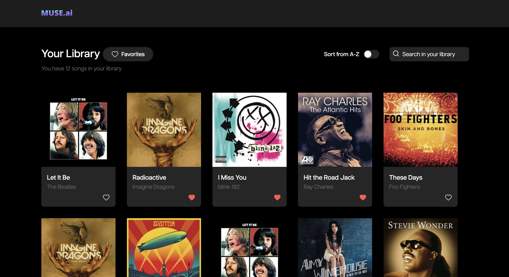

# MUSE.ai

## Description

This project was developed using the following technologies:

- [Next.js](https://nextjs.org/)
- [TypeScript](https://www.typescriptlang.org/)
- [Tailwind](https://tailwindcss.com/)

## Demonstration



## Prerequisites

- Node.js
- npm ou yarn

## How to run the project

1. **Clone the repository or download the project to your machine:**

   ```bash
   git clone https://github.com/leticiafrontend/muse-ai
   ```

2. **Install dependencies:**

   ```bash
   yarn
   # or
   npm install
   ```

3. **Create a `.env` file and add the environment variables according to `.env.example`:**

   ```bash
   NEXT_PUBLIC_API_BASE_URL=
   ```

4. **Start the server:**

   ```bash
   yarn dev
   ```

## Commands

- `dev`: runs your application on `localhost`
- `build`: creates the production build version
- `lint`: runs the linter in all components and pages
- `format`: runs the linter and fixed in all components and pages
- `prepare`: runs the husky config
- `start`: create the preview version similar with production version on your machine
